  HIP: 32
    Title: HLC-based decentralized gateway
    Author: dzeyu<dzychain@outlook>
    Category: Process
    Status: Draft
    Created: 2019-05-20
    
    
#基于HLC的去中心化网关HBC

  #背景             
数字资产质押痛点

	2017年底每枚BTC的价格达到了2万美元，市值前十的数字货币24小时交易总额达900亿美元，随着用数字货币的户数量增加，在数字资产价值不断上升期间，将手中的数字资产质押以获得部分资金的快速流转，从而能够实现日常购物、房屋装修、旅游、复投等需求的同时也能享受数字资产上升所带来的增值，这类需求在不断扩大。
	
	传统的资产质押模型中，质押方和资方之间的需要强有力的信任机构做背书，第三方做担保的解决方案会带来一系列中心化风险。
	
	首先，信任成本极高，不管是P2P平台、还是线下各种中介担保机构，平台因为政策、自身管理等因素，单方面跑路的案例并不在少数，究其原因在于中心化机构在质押借贷业务中有太多的作恶空间，特别如果质押物是很容易变现数字资产时，大金额的数字资产质押业务中谁来担保平台方不会跑路？这对于资产方和资金方都需要极大的信任成本。

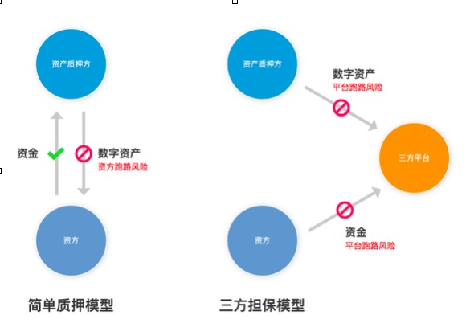
其次，交易成本高昂，传统资产质押借贷业务中，资产的确权、移交、资金方和资产方资格确认需要繁琐的手续，用户在质押资产时需要提供个人敏感信息，包括:身份证明、收入证明、税收证明、资产证明等，这种低效率的做法增加了整个信贷流程的复杂性，提高了整个行业的交易成本，减少了现有资本的流动性供应。

去中心化优势
	
	现在我们已跨入区块链时代，数字货币的本质是通过密码技术和共识算法借助P2P网络搭建的一套分布式记账系统，点对点的传输意味着该系统一个去中心化的支付系统。其资产的创建、分发和维持并且不需要经过中心化的机构认可，同一份账本被保存在成千上万个节点上，针对单一节点的攻击、数据篡改并不能改变整个系统的数据结构。

	通过去中心化系统实现数字资产质押业务，避免了平台跑路风险，借贷业务的产生无需在找第三方平台作担保，也不存在谁来担保第三方平台安全性的担保死循环问题。同时数字资产仅在链上流转，用加密学解决资产认证确权问题，持有秘钥即可获得资产支配权，大大降低了业务复杂性，减少了交易成本，这一点是中心化系统无法比拟的。
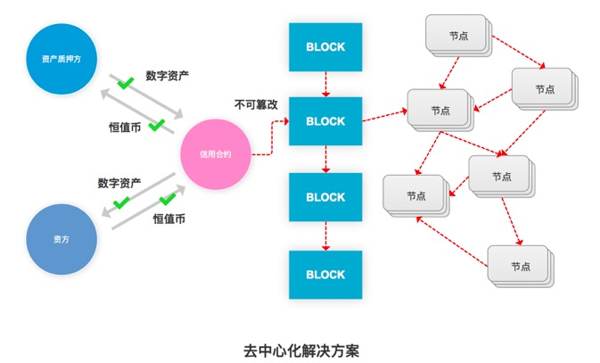

#技术要点

    通过智能合约实现去中心化的网关，将网关规则转换成代码，在链上执行，需要解决两个关键问题。

#链上数据和链下数据交互
    链下数据包括数字资产价格和链下资产支付结果。被质押的数字资产对链下法币的价格数据可以通过Oracle预言机实现互通，关键点还是在于链下资产支付结果的确认，Alice 将手中的 ETH 按照当天某一时刻对美元的成交价格计价折算后质押给 Bob，这一笔交易将在智能合约上发结算，智能合约可以锁定数字资产，但 Bob 是否支付相应的美元给 Alice 使用Oracle和智能合约通讯并不安全，因此可行的方案是使用恒值币，将链下承兑这一块风险分层隔离，形成链上闭环。

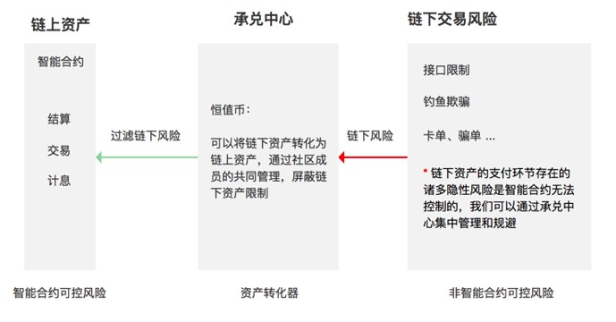

恒值币会带来承兑风险，如何保证恒值币能自由兑换标的资产，我们会在《经济模型白皮书》里详细阐述，这里不做分析，当然如果用户不太认可平台本身开发的恒值币，也可以兼容其它基于ERC20开发的恒值币。

跨链交易
	
    目前基于ETH的智能合约已经非常成熟，可以在ETH公链基础上开发借贷结算合约，恒值币合约，整个以太系的数字资产质押业务都可以在ETH链内完成，而BTC、EOS等以太系外得代币，就需要通过跨链技术，实现资产转化，最终目的是统一到ETH链上完成数字资产的质押业务。

半中心化解决方案是通过交易所将 BTC 转成 BTC 对应到 ETH 链上的 ERC20 token（BTCToken），在通过智能合约完成质押借贷业务。
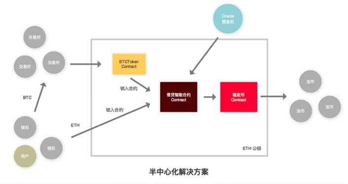

半中心化解决方案会带来而外的交易所承兑风险，不但提高了交易成本，还使得整个系统的风险增大。

	现有解决跨链的方案有公证人机制（Notary schemes），侧链/中继（Sidechains/ Relays）和哈希锁定（Hash-locking）技术，BTC的脚本运算会受到非常多的限制，要解决借贷业务的各种需求，明智的做法是在 ETH 上做一个 BTC 的映射币，将复杂的业务逻辑搬到以太合约，跨链只要解决如何保证以太上的 BTC 映射币能与主链的 BTC 对应。
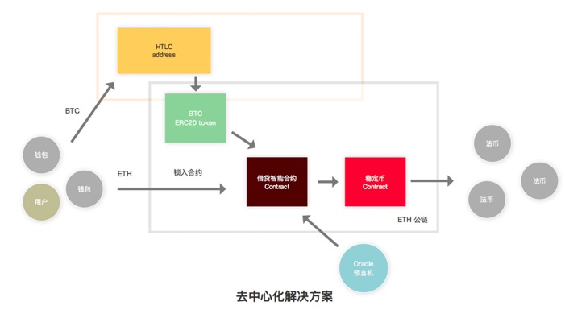

#技术实现
用户角色
	
	信用合约主要解决了资产质押业务中，债权人和债务人之间的信任问题，通过去中化系统为借贷双方提供可靠的资产托管平台。
	
	我们可以将合约的使用者分为两个角色：

	债权人（Creditor）：通过购买信用合约借出资产的一方。
	
	债务人（Debtor）：质押数字资产创建合约的一方。

质押业务生命周期

	一次完整的数字资产质押业务由创建合约 -> 筹款成功 -> 合约销毁三个时间节点构成，为了方便说明，我们仍然用 Alice 和 Bob 举例。

	首先我们先定义几个重要的变量：
	债务人（Debtor）：Alice，手上持有 Token ，需要通过质押获得稳定币。
	债权人（Creditor）：Bob，持有稳定币，愿意购买 Alice 信用合约。
	合约创建时间：，Alice 创建借贷合约，开始筹款的时间。
	筹款终止时间： ，合约创建成功后，规定  时刻后，若Bob没有支付足额的稳定币，则合约自动终止，被合约锁定的 Token 自动归还至 Alice。
	合约终止时间：，借款时长，Alice 承诺筹款成功后时刻偿还所有本金及利息。
	筹款成功状态：，Bob支付了足额的稳定币给Alice。
	还款成功状态：，Alice已偿还所有本金及利息。
	爆仓：，Alice质押的数字资产价值不足以偿还所有本金及利息。

	整个信用合约的生命周期如下：

	（1）Alice 在  时刻创建合约并转入相应的 Token，合约锁定 Token。
	（2）Bob 在  前支付稳定币给 Alice，则筹款成功，即满足  && t ===  条件。若 Bob 未支付足额稳定币给 Alice，即满足  && t ===  ，则合约返还 Token 给 Alice 并自动销毁。
	（3）Alice 在  前，质押资产价值未触发爆仓条件且 Alice 偿还所有本息，即满足  && t <  &&  条件时，Bob 获得投资收益，Alice 赎回 ETH，合约销毁。若 Alice 到期未偿还本息或期间触发平仓条件而 Alice 仍未支付本息，则合约将 ETH 发送给Bob，并销毁。

博弈过程
	
	债权人和债务人的利益诉求随着合约生命周期变化而改变。
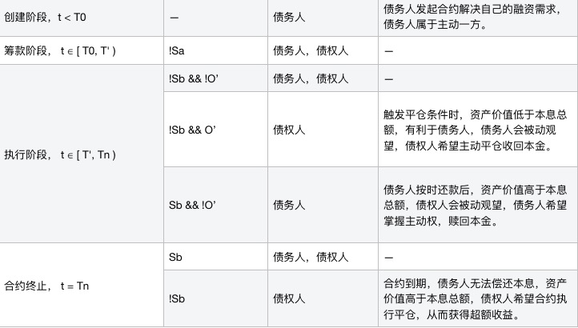
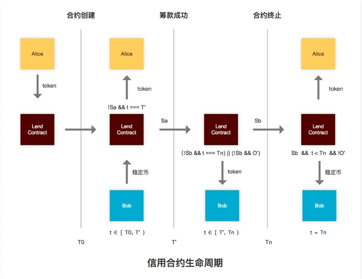

作为最有话语权的数字货币 BTC，其智能合约受限于逆波兰表达式，不支持状态机，在借贷合约的整个生命周期中，债权人和债务人的主动性相互转化，单纯的hash锁很难实现完整的质押、赎回流程，比较可靠的实现方式是将 BTC 端的合约复杂度尽量降低，把借贷业务逻辑集中到 ETH 上实现。

	具体解决方案是把合约分为两部分，资产锁合约和跨链资产锚定合约。

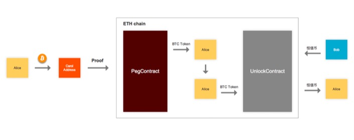

资产锁合约
hip-0032
	整个质押过程的本质就是质押资产的锁定与解锁，以及解锁后的归属者问题。通过智能合约可以实现资产的锁定、解锁、解锁后资产的分配功能，该部分合约使用ERC协议实现链上智能质押。
	
	资产锁合约负责锁定数字资产、转让恒值币、监控市场价格和自动平仓功能，通过预言机（Oracle）实现链下资产交易价格数据和链上的通讯。

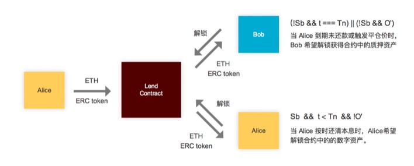

资产锁合约执行流程：

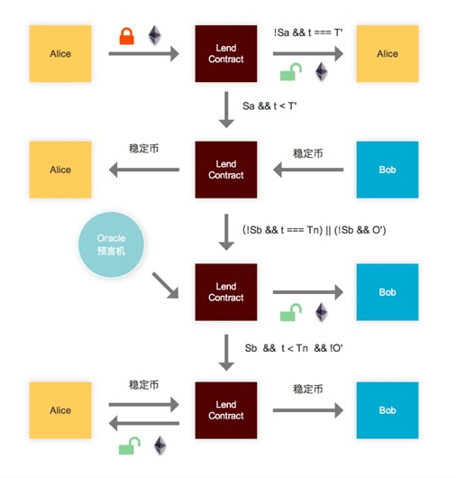

跨链资产锚定合约

	跨链资产锚定合约要 ETH 和 BTC 的双向锚定，这里需要加入一个中继人（Relay people）角色。
	
	中继人：通过在 ETH 上质押一定价值的资产以获得发行 E-BTC 的权利。
	
	本质上以太上的 E-BTC 相当于中继人在以太上发行的 BTC 债券，债券信用由中继人质押的资产保证，在该业务中，要求每个 E-BTC 须搭上生产标记，用户通过标记可以查到该 E-BTC 的保证金是否充足，且每个 E-BTC 只能由其所属的合约销毁，这样设计能避免中继人以极低价值资产作为担保质押 BTC 给自己，在通过其他人的 E-BTC 赎回自己的质押资产，从而低价套利获得 BTC。
	
	跨链资产锚定合约须满足如下要求：
	
	1）货币 BTC 和 E-BTC 的转换不需要第三方参与。
	2）无需在比特币中使用任何新的操作码。
	3）当 E-BTC 被销毁后，在规定时间内若中继人未将 BTC 返还给质押者时，合约可以将锁定的资产返送给质押者作为惩罚。

	中继人可以通过的提供担保服务获得锚定手续费，手续费通过恒值币支付到中继人的以太账户。
	
	跨链资产锚定合约流程：
	（1）Carol 在以太上创建跨链锚定合约，质押一定数量token。
	（2）Alice 发送 BTC 至 Carol 账户。
	（3）Alice 通过 BTC Relay 验证，在跨链锚定合约上生成质押凭证 E-BTC。
	（4）Alice 使用 E-BTC 质押到资产锁合约中，获得恒值币。
	（5）Alice 归还 E-BTC 到跨链锚定合约中。
	（6）链锚定合约中跨链锚定合约开始计时。
    （7）Carol 通过 BTC Relay 验证，释放自己质押在合约中的资产，若超出限定时间，则锁定资产按比列转入 Alice 以太地址。
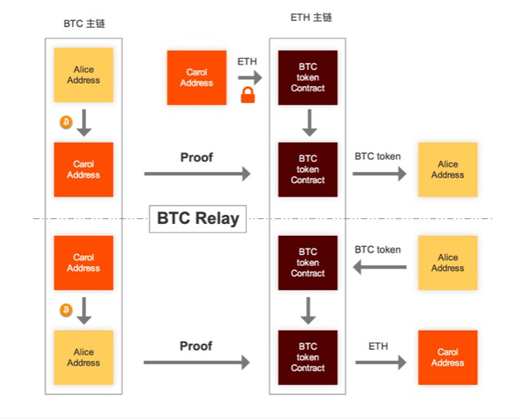

跨链资产合约配置：
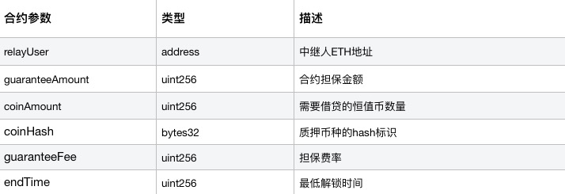

Alice 获得的 E-BTC 本质上是一张 Alice 在中继人处质押了一定数量的 BTC 的凭证，该凭证可以用作其它交易

E-BTC 配置：

E-BTC 生产流程：

E-BTC 销毁流程：

跨链资产锚定风险控制	
	
整个跨链资产锚定业务流程涉及两类风险：市场风险和系统风险。

	
	市场风险：由于资产价格波动，导致锚定合约的担保资产价值下降，低于被担保TOKEN价值，该类风险主要来自于市场本身，由市场自由交易机制处理，非技术手段解决。
	
	系统风险：
	（1）中继人秘钥丢失：一般中继人应使用多签（multisig）地址，以保障账户安全。	
	（2）质押方无法偿还 E-BTC：当 Alice 无法或无意偿还偿还 E-BTC 时，	中继人Carol 的担保资产会被一直冻结，这对 Carol 非常不公平，因此每一个 E-BTC 都应设置有效期，超过有效期后， E-BTC 自动销毁，Carol 得以释放自己的冻结资产。

系统角色的权益与义务

	过去中心化系统安全可靠的完成数字资产质押业务，通过引入了中继人角色，我们解决跨链资产的质押问题，用户角色间的业务关系被划分为两类关系：
	
	一对一关系：由于我们HLC采用的是UTXO账户模型，我们HLC完全可以和类BTC的token实现原子交换 同时我们也适用于 ERC20 资产的质押业务，债务人和债权人通过ERC智能实现借贷业务。

	中继人关系：适用于跨链场景，债务人和债权人之间无法直接发生借贷业务关系，需要通过中继人将债务人的数字资产转化为 ERC 资产，在进行链上智能借贷业务。

    
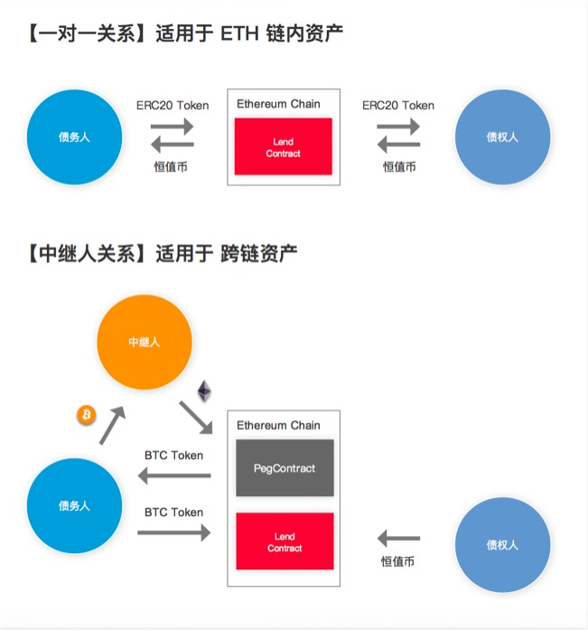
    
    
各角色收益:

一对一关系中，交易成本由矿工费✖️3、利息组成，债务人支付全部成本，因为涉及到合约创建、恒值币转移、资产赎回操作，所以需要至少进行3次合约交互。

中继人关系中，交易成本由跨链资产交易费用、矿工费✖️5、借款利息，债务人承担全部成本，除了借贷合约上的资产兑换，还需要在主链上进行两次资产交换，至少需进行5次合约交互，跨链资产交易费用由中继人收取，通过合约自动执行。
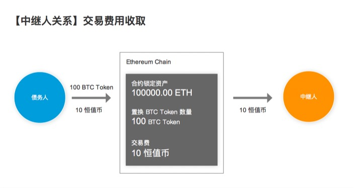

具体流程为：

	（1）债务人 Alice 和 中继人 Carol 约定 Carol 给 Alice 100 BTC Token，归还时，Alice 需付给 Carol 10个恒值币。

	（2）Alice 向 PegContract 发送 100 BTC Token + 10 恒值币 。
	
	（3）PegContract 合约自动判断是否支付足额交易费用，若已支付则将 10 恒值币发送至 Carol 账户，若未足额支付恒值币，则不执行赎回流程。
	
盈利空间

	资方（投资机构）有两种显而易见的盈利模式：

	（1）资方直接通过 LendContract 合约借出恒值币，获得利息回报，截止 2019.9.24 日，排名前三的数字代币流通总市值约￥11018 亿人民币，若每年有 10% 的流通资产有质押需求，年化收益 10% ~ 30%（火币杠杠交易资产借贷日息 0.1% 年化 36% ），则整个借贷市场保守预计每年有 110.18 ~ 220.36 亿的利润，而随着数字代币的用户数增加，这个数字只增不减。

	（2）资方充当中继人，收取交易费用，在成熟的交易所里进行币币对交换，交易所一般收取双向手续费，费率 0.2%，用户提现费用最低 0.0005 BTC，交易点差 0.06 %，交易成本约为 0.5% ，且无法保证资产能原价赎回。用户可以接受 0.3 ~ 0.5% 交易成本，出去矿工费，中继人至少能获得 0.2% ~ 0.4% 的交易提成，截止2019.9.24 日，排名前三的的数字代币 24h 交易额总计约 ￥4122536 万元，若每年占有 10% 的市场份额，则保守估计每年中继人市场有 296822 万元人民币的利润空间。	
	
最后我们的网关设计思考如下 借鉴cosmos的设计思路：	

让我们先来假设，如果要求任何想要通过HBC连接到HLC的链必须抵押一定的HLC，会发生什么。这会导致其他链的价值注入HLC中，从而使HLC价值飞升，对不对？逻辑上好像没错，但问题是如果这么做了，别的链为什么会愿意敞开大门，让自己的价值流入HLC中，任由你HLC来打劫呢？

这样做只会导致一个结果，没有人愿意同你连接，所谓跨链只能沦为空谈。

HBC的目标是要成为跨链的标准协议，如果你看一眼现实中那些真正成为了标准的协议，比如 TCP/IP、HTTP，就会发现关键的一点：它们都是免费的。

想要成为标准，就必须吸引尽量多的人加入，也就不能老想着去分别人的蛋糕，因为大家都不傻。所以HLC是断然不能利用HLC来吸取其他链价值的。只有让其他链以完全免费的方式接入自己，HBC才有可能成为真正的跨链标准。

既然只能免费，那是不是说HLC根本赚不到钱呢？这是一种典型的零和思维，但问题在于，跨链并不是一个零和游戏，而是一个正和游戏，因为跨链本身就会创造出巨大的新价值！这不是在分蛋糕，这是在把蛋糕做大！

这些新创造出来的巨大价值将储存在整个HLC生态中。然而整个生态中可能会有很多个token，那是不是就意味着，HLC作为其中一个并不能分到多少羹呢？

我们的HBC协议可以简单高效免费的让大家支持 这样可以形成一个价值洼地

我们的HLC就是整个价值的共识 

而我们的网关可以借鉴cosmos我们首批节点选择21个 最大上限50个节点

然后每个节点根据质押的HLC的情况来获取这个网关的投票治理权利

每一个节点都是根据质押的情况和用户选择的情况来进行末尾淘汰保证网关的活力和公平参与的权利

总结

	信用合约包含了跨链资产交换合约和借贷合约两部分组成，跨链资产交换合约除了质押借贷业务场景外，还可以拓展到各种资产上链、虚拟资产价值交换等需求。
	
	

